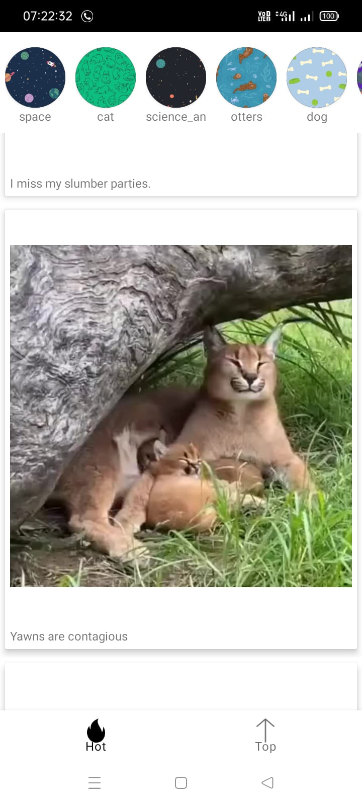
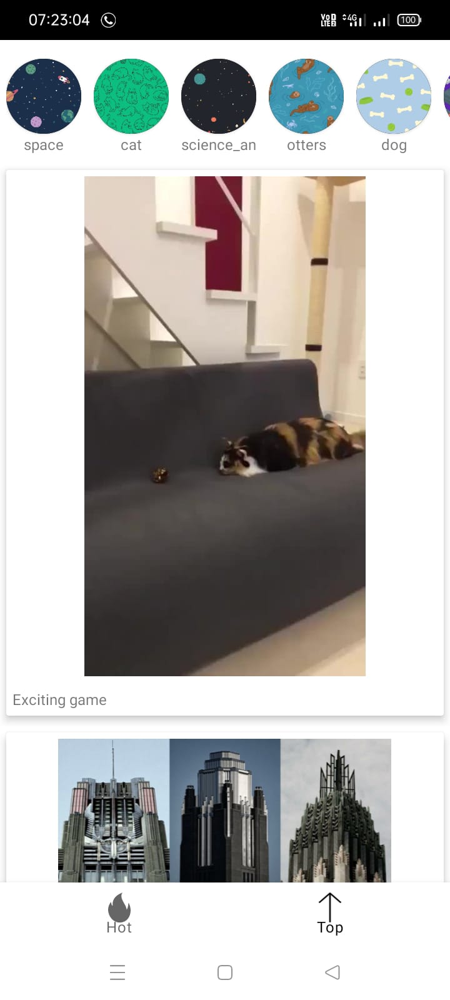
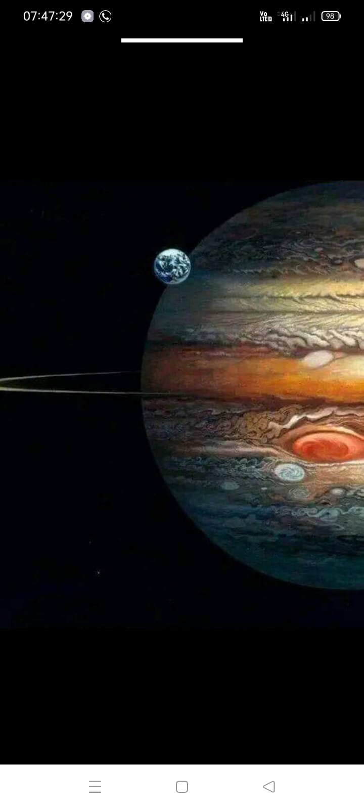

# MyImguram
Insta clone made using Imgur API.
The idea behind building this app was to test my knowledge that I gathered after watching https://www.youtube.com/watch?v=5bD9sDyqmDI.
Tried to build it on my own after watching the tutorial to solidify my learning.Used the video as a reference whenever I got stuck but tried doing major part of the project on my own.
## Screenshots
### Hot Feed

### Top Feed

### Story 

